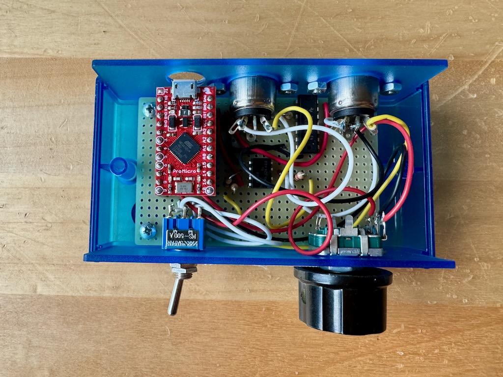

# MIDI mangler

This repository contains different firmwares for a custom MIDI
processing box I built.

## Hardware

The hardware is built around a [Sparkfun Pro
Micro](https://www.sparkfun.com/pro-micro-5v-16mhz.html)
[ATmega32U4](https://www.microchip.com/en-us/product/atmega32u4)
development board. Power is supplied via the micro USB socket of the
Pro Micro. There is a MIDI in circuit based on a 6N138 optocoupler,
and a MIDI out with a [SN74HC08](https://www.ti.com/product/SN74HC08)
as a line driver. I'm not really sure that the SN74HC08 is needed now
that I look at it but it's there.

Besides the MIDI I/O, there is a rotary encoder attached to the GPIO
of the MCU and a switch connected to the MCU reset pin. There is a
reset button on the Pro Micro itself but I wanted to be able to
reprogram the device without opening it up all the time so I added the
outside switch.

### Uploading firmware

To enter the bootloader you need to reset the device two times in
quick succession. A USB device will appear on the host and you have an
8 second window to connect to it.

I find this difficult to work with because it takes a second or so
before the USB device appears so you have to be patient but also fast
because the bootloader goes away after 8 seconds.

## Software

Different branches have different projects on it. I make a new branch
whenever I have a new project I can use this box for.
